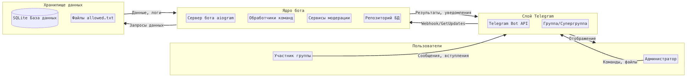
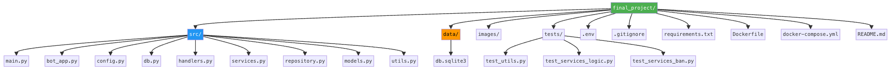
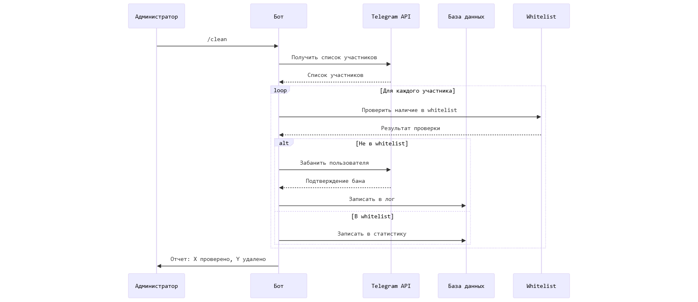

# Проект "Даша бот"
## 1. Описание продукта  
**Даша бот** – Telegram-бот для автоматической модерации чатов. Он проверяет участников на наличие в утвержденном списке (файл `.txt`) и удаляет неразрешенных пользователей.  

**Проблема:**  
- Ручная модерация чатов отнимает время
- Риск пропуска неразрешенных пользователей

**Решение:**  
- Автоматическая проверка новых участников 
- Команда `/clean` для полной очистки чата

## 2. Что будет видеть пользователь?

Пользователь взаимодействует с ботом через Telegram. При вводе команды `/start` бот будет отвечать приветственным сообщением и показывать возможные команды. 
1. **Загрузка списка**:
``` sh
Примерный диалог:
Админ (личка): /start
Бот (личка): Привет! В личке пришлите .txt со списком разрешённых (по одному в строке). В группе используйте команду /clean.
Админ: [отправляет allowed.txt]
Бот: Список разрешенных пользователей обновлен: 42 записей.
```
2. **Очистка чата**:
``` sh
(в группе)
Админ: /clean
Бот: Запускаю очистку... (проверяю известных участников)
Бот: Проверено: 42. Найдено: 3. Забанено: 3.
```
3. **Автоматическая проверка**:
- При входе нового участника бот сверяет его с белым списком и банит, если его нет в списке


---

## 3. Архитектура  
### 3.1. Технологический стек  
- **Python**  
- **Aiogram** (бот)  
- **SQLAlchemy** (работа с БД)  
- **SQLite / PostgreSQL** (хранилище)  
- **Docker + Docker Compose** 
- **Pytest** (тестирование)  

### 3.2. Схема файлов


---

### 3.3 Схема архитектуры
Схема архитектуры бота-модератора. На схеме показано взаимодействие пользователя через Telegram с Telegram API, дальнейшая передача сообщений на сервер бота (реализация на aiogram), где происходит проверка и модерация. Бот взаимодействует с базой данных (для хранения логов и статусов) и с админом/группой



---

## 4. Схема базы данных  
    ALLOWED_USERS {
        int id PK
        string user_identifier UNIQUE
        datetime created_at
    }

    MEMBERS {
        int id PK
        string chat_id
        string user_id
        string username
        datetime last_seen
    }

    ACTION_LOGS {
        int id PK
        string chat_id
        string user_identifier
        string action
        datetime timestamp
        string reason
    }

### 5. Задачи и оценка времени
| Этап | Задача | Исполнитель | Оценка |
| :--- | :--- |:------------| :--- |
| **Этап 1:** <br>Подготовка <br>(~1-2 дня) | 1. Регистрация бота в @BotFather, настройка `.env` | Лиза        | 0.5 дн. |
| | 2. Настройка базовой структуры проекта, `requirements.txt` | Лиза        | 0.5 дн. |
| | 3. Инициализация БД (`db.py`), создание моделей (`models.py`) | Маша        | 1 дн. |
| **Этап 2:** <br>Ядро логики <br>(~3-4 дня) | 4. Реализация `ModerationService` (фильтрация, бан)(`services.py`) | Маша        | 1.5 дн. |
| | 5. Написание репозиториев для работы с БД | Маша        | 1 дн. |
| | 6. Разработка парсера `.txt` (`utils.py`) | Лиза        | 0.5 дн. |
| | 7. Создание основных хендлеров: `/start`, приём файла, логгирование | Лиза        | 1 дн. |
| **Этап 3:** <br>Интеграция и функции <br>(~2-3 дня) | 8. Реализация хендлера для автоматической проверки новых участников | Лиза        | 1 дн. |
| | 9. Реализация команды `/clean` | Лиза        | 0.5 дн. |
| | 10. Настройка БД (`ActionLog`)(`models.py`) | Маша        | 0.5 дн. |
| | 11. Тестирование: загрузка файла -> проверка нового юзера -> команда `/clean` | Вместе      | 1 дн. |
| **Этап 4:** <br>Финальные доделки <br>(~2-3 дня) | 12. Написание тестов | Маша           | 1 дн. |
| | 13. Создание `Dockerfile` и `docker-compose.yml` | Лиза        | 1 дн. |
| | 14. Написание финальной документации | Вместе      | 0.5 дн. 
| | 15. Финальное ревью кода, проверка требований | Вместе      | 0.5 дн. |
| **Итого:** | |             | **~8-12 дней** |

<p align="center">
  
</p>
